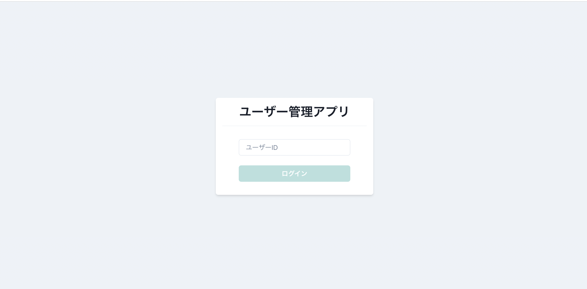
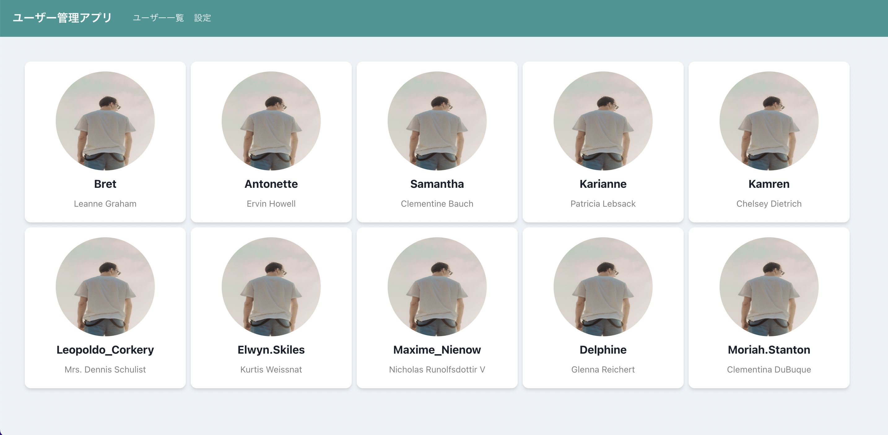
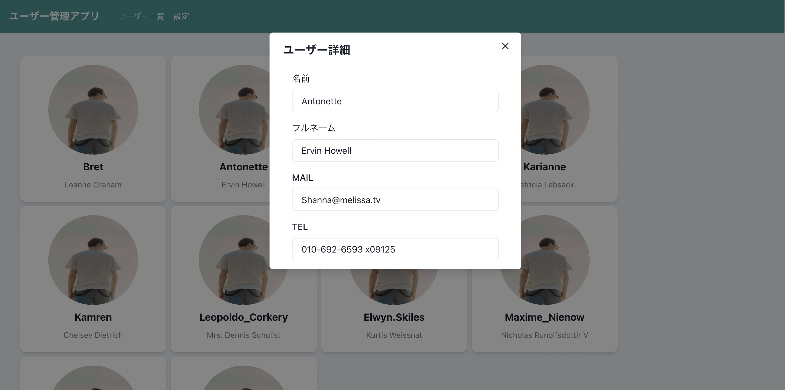

# chakra_ui_app
 
React・TypeScript・chakraUIを用いたユーザー管理アプリ
# DEMO
 



  
# Requirement
 
"Go-blockchain"を動かすのに必要なライブラリなどを列挙する
 
* react 18
* macOS(windowでの検証はしてない)
* chakraUI 2
 
# Installation
 
必要なライブラリのインストール
 
```bash
npm i @chakra-ui/react @emotion/react @emotion/styled framer-motion
npm install axios
```
 
# Usage
 
アプリの実行方法
 
```bash
git clone https://github.com/kentakki416/react-chakra-ui-app.git

cd chakra_ui_app

// typescriptのインストール
npm install -g typescript

// Installationのライブラリをインストール
省略

npm start

```

# Function
実装した機能の概要紹介
* APIによる画像の取得
* ATOMICデザインによるコンポーネント分割
* 管理者による編集権限の実装
* chakraUIを用いたレスポンシブ対応
* ログイン機能

# Note
 
バッグエンドでの実装は行っていません。
 
 
# License 
"Go-blockchain" is under [MIT license](https://en.wikipedia.org/wiki/MIT_License).
 
